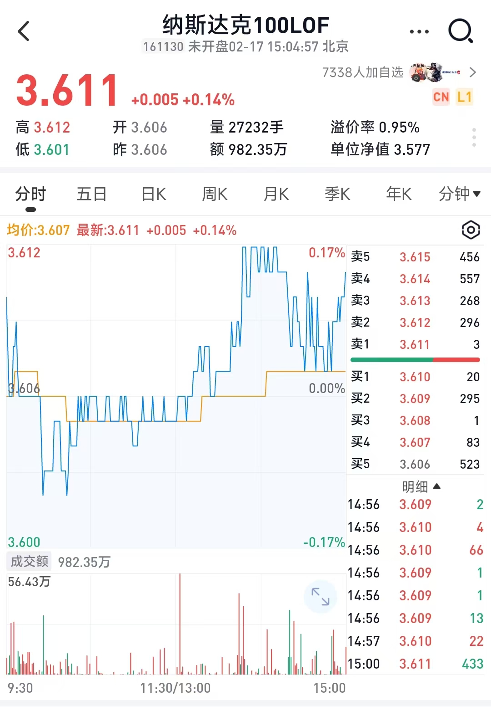

# TickLine

### 背景

最近在研究基金时发现，市面上的炒股APP只能看到分钟级别的数据，而一些大涨大跌的行情需要更细致的结构才能观察到行情的变化，

这个项目就是把每个tick(3秒一次的level1数据)用图形展示出来

这是一个demo演示项目, 使用了react + echarts. 展示Tick级的价格变化。

...
最近兴趣又转到了美股期权上了，这个项目先占个坑，后面有时间再更新吧

### 下面两张图是1分级别数据和tick数据的对比

通过Tick图可以看到很多的细节。

如图演示的日内行情，可以看到在13:48:15这个时间点有一个快速涨幅，  

在最高点时，此时只是Ask1的价格很高，对应的Bid1仅有17手, 也就是说在实盘交易时最多只有`17手`可以实现在波峰处卖出。

# 项目运行

pnpm dev

pnpm run build

pnpm preview --host

