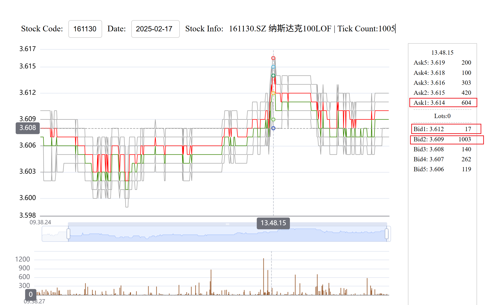

# TickLine

### 背景

最近在炒股时发现，市面上的炒股APP只能看到分钟级别的数据，而一些大涨大跌的行情需要更细致的结构才能观察到行情的变化，

这个项目就是把每个tick(3秒一次的level1数据)用图形展示出来

这是只是一个demo演示项目，放出代码让有兴趣研究tick级别数据的人进行参考

### 下面两张图是1分级别数据和tick数据的对比

通过Tick图可以看到很多的细节。

如图演示的日内行情，可以看到在13:48:15这个时间点有一个快速涨幅，  

在最高点时，此时只是Ask1的价格很高，对应的Bid1仅有17手, 也就是说在实盘交易时最多只有`17手`可以实现在波峰处卖出。

# Command

pnpm dev

pnpm run build

pnpm preview --host

